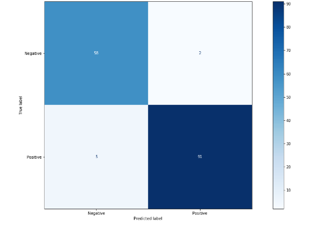

# Diabetes Prediction

Prediction of diabetes with a single decision tree and random forest is tested.

 

## Data Source

Islam, MM Faniqul, et al. 'Likelihood prediction of diabetes at early stage using data mining techniques.' Computer Vision and Machine Intelligence in Medical Image Analysis. Springer, Singapore, 2020. 113-125.

The data is avilable at: https://archive.ics.uci.edu/ml/datasets/Early+stage+diabetes+risk+prediction+dataset

